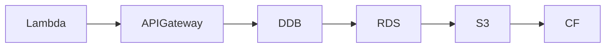

# InfraTales | AWS CDK Multi-Region Disaster Recovery: Trading Platform Setup with DynamoDB Global Tables and Route53 Failover

**AWS CDK TYPESCRIPT reference architecture — platform pillar | advanced level**

> Your trading platform's DR plan looks great in a runbook but has never been tested under real failover conditions — and the first time it gets tested is at 2am when us-east-1 is having a bad day. This project tackles the operational reality of running a multi-region active-passive setup where DynamoDB global tables, S3 cross-region replication, Lambda deployments, and Route53 weighted routing all need to be in sync before you can safely cut over. The secondary problem is equally common: spinning up a secure, HA single-region stack (VPC, RDS, API Gateway, CloudFront, Secrets Manager) without cutting corners on IAM least-privilege or logging.

[](LICENSE)
[](CONTRIBUTING.md)
[](https://aws.amazon.com/)
[](https://aws.amazon.com/cdk/)
[](https://infratales.com/p/4e953a15-3f0f-4fd7-9e39-ca762d6de5c7/)
[](https://infratales.com)


## 📋 Table of Contents

- [Overview](#-overview)
- [Architecture](#-architecture)
- [Key Design Decisions](#-key-design-decisions)
- [Getting Started](#-getting-started)
- [Deployment](#-deployment)
- [Docs](#-docs)
- [Full Guide](#-full-guide-on-infratales)
- [License](#-license)

---

## 🎯 Overview

Problem A deploys two mirrored CDK stacks — primary in us-east-1, DR in us-west-2 — sharing reusable constructs for DynamoDB global tables (on-demand, PITR), S3 buckets with CRR lifecycle rules, SNS cross-region topics, Step Functions DR orchestration state machines, and Route53 weighted routing with health checks [from-code]. Problem B adds a single-region stack in us-east-1 with a VPC (2 public + 2 private subnets), PostgreSQL RDS on db.m4.large managed by Secrets Manager, a Node.js 14.x Lambda behind IAM-authenticated API Gateway, SQS for async processing, and CloudFront for static asset delivery [from-code]. A TypeScript deployment orchestrator class wraps CDK synth, deploy, and post-deploy validation in a single script, enforcing cross-region replication health checks as a hard gate before marking deployment complete [from-code]. CloudWatch dashboards aggregate metrics from both regions using cross-region metric math expressions rather than simple per-region dashboard widgets, which requires explicit cross-account IAM trust when the DR stack lives in a separate AWS account [inferred].

**Pillar:** PLATFORM — part of the [InfraTales AWS Reference Architecture series](https://infratales.com).
**Target audience:** advanced cloud and DevOps engineers building production AWS infrastructure.

---

## 🏗️ Architecture



> 📐 See [`diagrams/`](diagrams/) for full architecture, sequence, and data flow diagrams.

> Architecture diagrams in [`diagrams/`](diagrams/) show the full service topology (architecture, sequence, and data flow).
> The [`docs/architecture.md`](docs/architecture.md) file covers component responsibilities and data flow.

---

## 🔑 Key Design Decisions

- DynamoDB global tables on-demand billing removes capacity planning overhead but can spike costs 3-5x during a DR drill that generates write amplification across both regions — budget for this before your first game day [inferred]
- Node.js 14.x Lambda runtime reached end-of-life in November 2023; using it satisfies the prompt constraint but means you are deploying into a deprecated runtime that AWS will block for new deployments on a rolling schedule — this is a day-one tech debt item [editorial]
- db.m4.large RDS is a previous-generation instance type; m5.large is the current equivalent and costs approximately 10-15% less on-demand while delivering up to 25% higher network throughput per AWS instance documentation, but the prompt locks you to m4.large — document this explicitly so the next engineer does not assume it was a deliberate choice [editorial]
- Route53 weighted routing with health checks gives you manual-dial failover control, but automated failover via Route53 health checks has a minimum 30-second evaluation period — for a trading platform with sub-second SLAs, this TTL gap needs a circuit-breaker at the application layer too [inferred]
- SSM Parameter Store SecureString replication across regions is not native — the deployment script has to handle cross-region parameter sync explicitly, which means your DR region's config can drift if the sync step is skipped or fails silently [from-code]

> For the full reasoning behind each decision — cost models, alternatives considered, and what breaks at scale — see the **[Full Guide on InfraTales](https://infratales.com/p/4e953a15-3f0f-4fd7-9e39-ca762d6de5c7/)**.

---

## 🚀 Getting Started

### Prerequisites

```bash
node >= 18
npm >= 9
aws-cdk >= 2.x
AWS CLI configured with appropriate permissions
```

### Install

```bash
git clone https://github.com/InfraTales/<repo-name>.git
cd <repo-name>
npm install
```

### Bootstrap (first time per account/region)

```bash
cdk bootstrap aws://YOUR_ACCOUNT_ID/YOUR_REGION
```

---

## 📦 Deployment

```bash
# Review what will be created
cdk diff --context env=dev

# Deploy to dev
cdk deploy --context env=dev

# Deploy to production (requires broadening approval)
cdk deploy --context env=prod --require-approval broadening
```

> ⚠️ Always run `cdk diff` before deploying to production. Review all IAM and security group changes.

---

## 📂 Docs

| Document | Description |
|---|---|
| [Architecture](docs/architecture.md) | System design, component responsibilities, data flow |
| [Runbook](docs/runbook.md) | Operational runbook for on-call engineers |
| [Cost Model](docs/cost.md) | Cost breakdown by component and environment (₹) |
| [Security](docs/security.md) | Security controls, IAM boundaries, compliance notes |
| [Troubleshooting](docs/troubleshooting.md) | Common issues and fixes |

---

## 📖 Full Guide on InfraTales

This repo contains **sanitized reference code**. The full production guide covers:

- Complete AWS CDK TYPESCRIPT stack walkthrough with annotated code
- Step-by-step deployment sequence with validation checkpoints
- Edge cases and failure modes — what breaks in production and why
- Cost breakdown by component and environment
- Alternatives considered and the exact reasons they were ruled out
- Post-deploy validation checklist

**→ [Read the Full Production Guide on InfraTales](https://infratales.com/p/4e953a15-3f0f-4fd7-9e39-ca762d6de5c7/)**

---

## 🤝 Contributing

See [CONTRIBUTING.md](CONTRIBUTING.md) for guidelines. Issues and PRs welcome.

## 🔒 Security

See [SECURITY.md](SECURITY.md) for our security policy and how to report vulnerabilities responsibly.

## 📄 License

See [LICENSE](LICENSE) for terms. Source code is provided for reference and learning.

---

<p align="center">
  Built by <a href="https://infratales.com">InfraTales</a> — Production AWS Architecture for Engineers Who Build Real Systems
</p>
